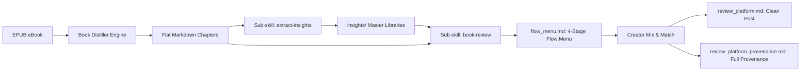

# Book Distiller (书籍蒸馏器)

> Precise chapter-by-chapter EPUB extraction to clean, flat Markdown documents with modular sub-skills (extract-insights: 4D raw materials + Obsidian graph; book-review: 4-stage modular mental flow menu + dual-file clean post and full provenance graph), smart noise filtering, YAML frontmatter, image assets, and structured indexes.

An Agent Skill for parsing and splitting `.epub` ebooks into clean, standalone Markdown chapters, preserving image assets and hierarchy, building `README.md` and `SUMMARY.md` catalogs for Obsidian, Notion, or GitBook, extracting creator insights, and orchestrating a human-in-the-loop writing pipeline with a 4-stage mental flow builder.

## ✨ Features

- **Strictly Flat Directory Structure**: All chapters are extracted side-by-side into a single folder. No confusing nested directories or broken relative links.
- **Modular Sub-skills (Advanced Creator Suite v2.9)**:
  - ⚡️ **`extract-insights`**: Extracts Contrarian Hooks (with 1-5 ⭐ viral ratings and 🔥 Top 5 pinned topics), Concrete Stories/Cases, Actionable Checklists, High-resonance Quotes, Obsidian Concept Graph (`[[Wikilinks]]`), and Symptom Mapping.
  - 🧩 **`4-Stage Mental Flow Selector`**: Before drafting, presents an inspiration menu across 4 key flow stages (Hook ➔ Inversion ➔ Action ➔ Ending), allowing creators to freely mix-and-match modular building blocks (e.g. `1B + 2A + 3A + 4A`).
  - ✍️ **`book-review (Dual-file Delivery)`**: 
    - `review_{platform}.md`: 100% clean, publish-ready post (Xiaohongshu, Threads, WeChat).
    - `review_{platform}_provenance.md`: Standalone design provenance archive with Mermaid flow chart, source lineage table, and concept wikilinks.
- **Smart Noise & Copyright Filtering**: Automatically detects and skips publisher copyright pages, empty title pages, redundant in-book TOCs, and broken internal XHTML anchors. Use `--keep-all` if you prefer to retain them.
- **Sequential Indexing**: Consecutively numbers chapters (`01_xxx.md`, `02_xxx.md`) without missing-number gaps.
- **YAML Frontmatter Injection**: Embeds structured metadata into every chapter header (`book`, `author`, `chapter_index`, `word_count`, `read_time`, `tags`).
- **Prev / Next Chapter Navigation**: Adds bidirectional `⬅️ Previous Chapter | 📑 Table of Contents | ➡️ Next Chapter` links at the bottom of every page with rock-solid relative paths (`./01_xxx.md`).
- **Image & Asset Extraction**: Automatically exports book covers, diagrams, and illustrations to `./assets/` and updates relative paths (``).

---

## 🧩 Sub-skills Ecosystem (子技能生态)



### 1. `extract-insights` (写作黄金原料库与灵感总库)

Refuses generic summaries. Focuses purely on extracting high-yield creator assets from any extracted chapter `.md`:
1. ⚡️ **Contrarian Hooks (反直觉认知)**: Common misconception vs deep counter-intuitive insight + 3 social hook variations + **Viral Rating (1-5 ⭐)**.
2. 📖 **Stories & Micro-cases (故事与微案例)**: Concrete character, conflict, key turning point, and core takeaway.
3. 🛠️ **Actionable Checklists (可落地微清单)**: 3-step execution framework + 1 "Never Do" boundary.
4. 💎 **Golden Quotes (高穿透金句)**: Emotionally resonant quotes with recommended social media usage contexts.
5. 🔗 **Obsidian Wikilinks**: Embeds `[[Concept]]` links for interactive graph visualization.
6. 🎯 **Symptom Mapping**: Connects reader pain points directly to the book's chapter solutions.

### 2. `book-review` (四段心流人机共创与双文件输出)

1. **4-Stage Flow Modular Menu**:
   - **Stage 1 (Hook / Painpoint)**: [1A Heartfelt scene] / [1B Contrarian slap] / [1C Soul question]
   - **Stage 2 (Inversion / Deconstruction)**: [2A Systemic root cause] / [2B Fear & motive analysis] / [2C High-dimensional model]
   - **Stage 3 (Action / Checklist)**: [3A Micro-habit slice] / [3B Red line rule] / [3C 3-step loop]
   - **Stage 4 (Ending / Warm Closing)**: [4A Warm encouragement] / [4B Piercing quote] / [4C Open question]
2. **Dual-file Output**:
   - Clean Post (`review_{platform}.md`): Ready to copy & paste.
   - Provenance (`review_{platform}_provenance.md`): Full lineage table & Mermaid chart.

---

## 🚀 Installation & Setup

### 1. Requirements

- Python 3.10+
- Dependencies: `pip install ebooklib beautifulsoup4 markdownify lxml`

### 2. Manual CLI Usage

```bash
# 1. Standard flat clean extraction
python3 scripts/extract_chapters.py "/path/to/book.epub"

# 2. Setup the 4 master insights libraries for an extracted book
python3 scripts/extract_insights.py "/path/to/extracted_book_folder"

# 3. Generate 4-stage flow modular menu and draft posts
python3 scripts/generate_review.py "/path/to/extracted_book_folder" --platform xhs --combo "1B+2A+3A+4A"
```

### 3. Agent Skill Integration

Clone this repository into your agent's skill directory:

```bash
# For Antigravity / Claude Code
git clone https://github.com/ubworkshop/book-distiller.git ~/.gemini/config/skills/book-distiller
```

## 📂 Output Structure

```text
Book_Notes/
├── README.md                                 # Book metadata and clickable table of contents
├── SUMMARY.md                                # Sidebar index (Obsidian / GitBook compatible)
├── assets/                                   # Extracted images, illustrations, and cover
│   ├── cover.jpg
│   └── figure_01.png
├── 01_Introduction.md
├── 02_Part1_My_Journey_Crossing_the_Threshold.md
├── 03_Part2_Life_Principles_Embrace_Reality.md
├── insights/                                 # 👈 Sub-skill: extract-insights
│   ├── 00_全书爆款选题与反直觉库.md            # (含 🔥 Top 5 必爆黄金选题置顶)
│   ├── 00_全书高穿透金句大全.md                # (带社交发帖语境)
│   ├── 00_读者现实痛点与对号入座索引.md         # (现实烦恼 -> 章节解法映射)
│   ├── 00_全书核心概念与思维模型图谱.md         # (Obsidian [[概念双链]])
│   ├── 01_Introduction_原料卡.md
│   └── ...
└── reviews/                                  # 👈 Sub-skill: book-review
    ├── flow_menu_20261006_120000.md          # 👈 四段心流积木备选菜单
    ├── review_xhs_20261006_120000.md         # 👈 纯净发布正文
    └── review_xhs_20261006_120000_provenance.md # 👈 独立血统溯源与联系图谱
```

## 📄 License

MIT License. See [LICENSE](LICENSE) for details.
