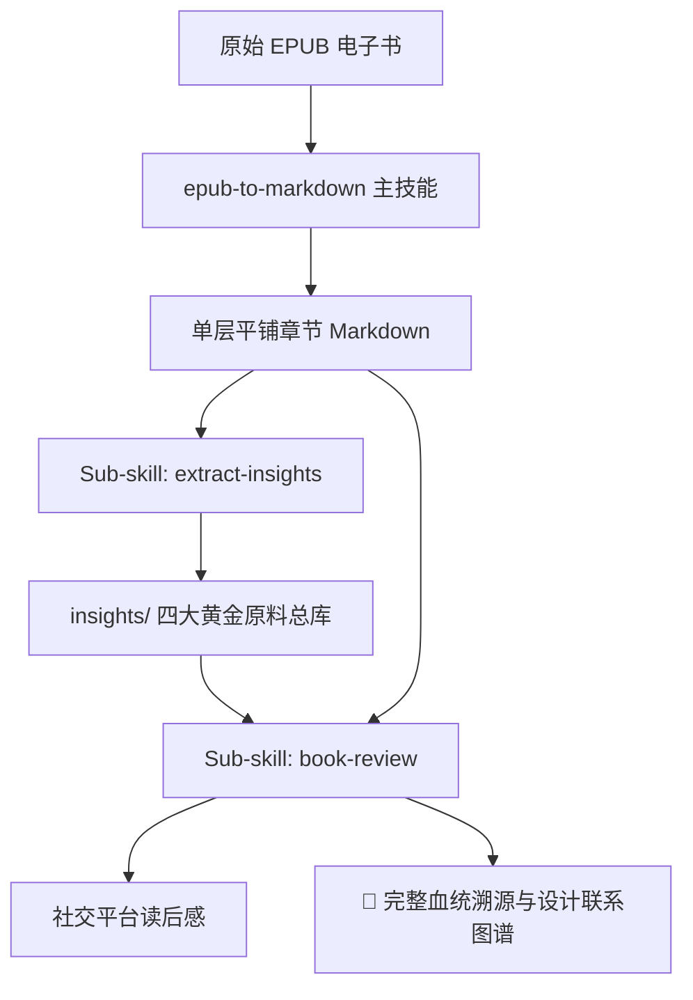

# EPUB 章节转 Markdown Skill (v2.7 模块化创作与溯源图谱版)

将 EPUB 电子书按章节结构自动解包、清洗，并转成一套规范的单层平铺独立 Markdown 知识库；同时向下游串联子技能流水线，实现从**书籍切分 ➔ 黄金原料挖掘 ➔ 多平台读后感生成 ➔ 完整血统溯源与联系图谱**的完整闭环。

## 核心架构与功能

1. **统一单层平铺（Flat Structure）**：所有章节文件与 `README.md` 统一存放在同一级目录下，绝不产生层级混乱，避免多级子文件夹导致的路径断链。若书籍含有大卷/分部，自动体现在文件名与目录标记中（如 `01_第一部_第一章.md`）。
2. **绝对稳定的相对路径**：所有图片统一引用 `./assets/xxx.png`，上一章/下一章统一为 `./xx.md`，在 Obsidian、Notion 或本地 Markdown 查看器中零死链。
3. **智能去杂质与版权页过滤**：自动识别并过滤书籍中的版权声明（ISBN、免责声明）、出版社宣传页与失效的内部 XHTML 目录跳转，保持知识库纯粹（可用 `--keep-all` 显式保留）。
4. **YAML Frontmatter 元数据注入**：每章开头自动生成结构化 YAML 头信息（包含书名、作者、章节序号、中英文字数统计、预估阅读时间、标签），完美适配 Obsidian 与 Notion 属性视图。
5. **章节底部连续翻页导航**：每章末尾自动生成 `⬅️ 上一章 | 📑 返回目录 | ➡️ 下一章` 互联链接。
6. **插图与资源保留**：自动提取书籍内的配图到 `./assets/` 目录，并在 Markdown 中重写为干净的相对路径引用（``）。
7. **自动化导航索引**：自动生成 `README.md` 与 `SUMMARY.md`。

---

## 🧩 挂载子技能体系 (Sub-skills Ecosystem)

本技能支持向下游扩展专业子技能流水线：



### 1. `extract-insights` (4+2 黄金原料提取)
- **定位**：拒绝无意义的全文大意总结，专门从切分好的章节中挖掘自媒体与长文创作的 4 类黄金原料：
  - ⚡️ **反直觉认知 (Hook 灵感)**：打破常识误区，提炼 3 种爆款钩子（含 ⭐⭐⭐⭐⭐ 爆款评级）。
  - 📖 **故事与微案例 (论据素材)**：具象人物冲突与破局案例。
  - 🛠️ **可落地微清单 (读者收藏向)**：三步流程法与避坑红线。
  - 💎 **高穿透金句 (社交配图)**：情绪共鸣强烈的金句与适用语境。
  - 🎯 **读者痛点对号入座**：直击现实烦恼的病症映射索引。
  - 🧠 **概念双链图谱**：Obsidian `[[概念双链]]` 网状知识网络。

### 2. `book-review` (高穿透读后感与完整血统溯源)
- **定位**：拒绝“中学语文课代表复述”，坚持“表面聊书，实解读者生活内耗”，遵循沉静温和、反爹味人设。
- **三大专属模具**：
  - 📱 **小红书深度图文模具**：双行反差标题 + 痛点直击 + 3个顿悟点 + 治愈收尾。
  - 🧵 **Threads / X 4帖串帖模具**：1/4 Hook引子 ➔ 2/4 认知反转 ➔ 3/4 行动解法 ➔ 4/4 温柔收尾（符合 ≤500 字一键分帖）。
  - 📰 **微信公众号 / 博客深度随笔模具**：生活散文引入 + 概念解构 + 现实困境剖析 + 沉浸随笔。
- **🧬 伴生输出：完整血统溯源与联系图谱 (Provenance & Lineage Blueprint)**：
  - 📊 **创作逻辑联系图谱 (Mermaid)**：清晰呈现从原著章节到社交文案的演进网络。
  - 📋 **核心要素血统溯源表**：逐项对齐原著出处、原料卡与创作心理学意图（打破防御、建立共鸣、促成收藏等）。
  - 🧠 **概念双链关联**：与 Obsidian 知识网络无缝挂载。

---

## 执行命令

```bash
# 1. 主流程：标准平铺纯净提取 EPUB 电子书
~/.agent-reach-venv/bin/python3 ~/.gemini/config/skills/epub-to-markdown/scripts/extract_chapters.py "<EPUB_FILE_PATH>" -o "<OUTPUT_DIR>"

# 2. 为已提取的书籍搭建写作原料库骨架 (extract-insights)
~/.agent-reach-venv/bin/python3 ~/.gemini/config/skills/epub-to-markdown/scripts/extract_insights.py "<BOOK_DIR>"

# 3. 为已提取的书籍生成社交媒体读后感与血统溯源草稿脚手架 (book-review)
~/.agent-reach-venv/bin/python3 ~/.gemini/config/skills/epub-to-markdown/scripts/generate_review.py "<BOOK_DIR>" --platform all --topic "走出内耗"
```

## 典型输出目录结构

```text
输出目录/
├── README.md               # 书籍元数据与完整正文平铺清单
├── SUMMARY.md              # 导航树索引
├── assets/                 # 提取出的全部插图、封面
├── 01_导论.md
├── 02_第一部_我的历程_探索.md
├── 03_第二部_生活原则_拥抱现实.md
├── insights/               # 👈 写作黄金原料库（调用 extract-insights 产生）
│   ├── 00_全书爆款选题与反直觉库.md
│   ├── 00_全书高穿透金句大全.md
│   ├── 00_读者现实痛点与对号入座索引.md
│   ├── 00_全书核心概念与思维模型图谱.md
│   └── 02_第一部_我的历程_探索_原料卡.md
└── reviews/                # 👈 读后感与溯源图谱库（调用 book-review 产生）
    ├── review_xhs_20261005.md       # 正文 + 🧬 完整血统溯源与联系图谱
    ├── review_threads_20261005.md   # 4帖串帖 + 🧬 完整血统溯源与联系图谱
    └── review_wechat_20261005.md    # 深度随笔 + 🧬 完整血统溯源与联系图谱
```
