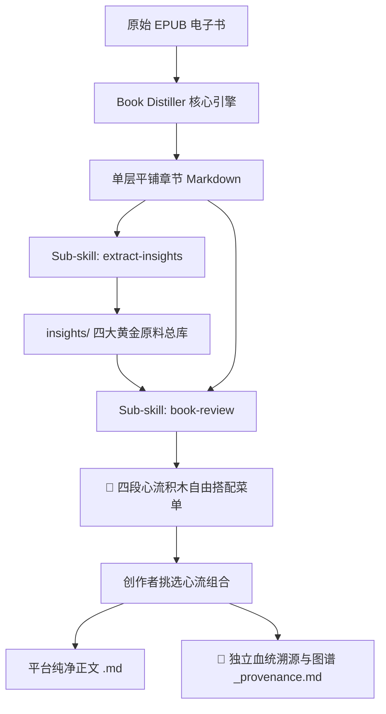

# Book Distiller (书籍蒸馏器 v2.9)

**从电子书章节拆解、黄金原料萃取到四段心流自由搭配与深度创作的一体化引擎。**

将 EPUB 电子书按章节结构自动解包、清洗，并转成一套规范的单层平铺独立 Markdown 知识库；向下游串联完整的创作者流水线，实现从**书籍切分 ➔ 4D黄金原料挖掘 ➔ 四段心流积木自由搭配 ➔ 多平台读后感生成 ➔ 独立血统溯源图谱**的完整闭环。

---

## 核心架构与功能

1. **统一单层平铺（Flat Structure）**：所有章节文件与 `README.md` 统一存放在同一级目录下，绝不产生层级混乱，避免多级子文件夹导致的路径断链。若书籍含有大卷/分部，自动体现在文件名与目录标记中（如 `01_第一部_第一章.md`）。
2. **绝对稳定的相对路径**：所有图片统一引用 `./assets/xxx.png`，上一章/下一章统一为 `./xx.md`，在 Obsidian、Notion 或本地 Markdown 查看器中零死链。
3. **智能去杂质与版权页过滤**：自动识别并过滤书籍中的版权声明（ISBN、免责声明）、出版社宣传页与失效的内部 XHTML 目录跳转，保持知识库纯粹（可用 `--keep-all` 显式保留）。
4. **YAML Frontmatter 元数据注入**：每章开头自动生成结构化 YAML 头信息（包含书名、作者、章节序号、中英文字数统计、预估阅读时间、标签），完美适配 Obsidian 与 Notion 属性视图。
5. **章节底部连续翻页导航**：每章末尾自动生成 `⬅️ 上一章 | 📑 返回目录 | ➡️ 下一章` 互联链接。
6. **插图与资源保留**：自动提取书籍内的配图到 `./assets/` 目录，并在 Markdown 中重写为干净的相对路径引用（``）。
7. **自动化导航索引**：自动生成 `README.md` 与 `SUMMARY.md`。

---

## 🧩 挂载子技能体系 (Sub-skills Ecosystem)



### 1. `extract-insights` (4+2 黄金原料提取)
- **定位**：拒绝无意义的全文大意总结，专门从切分好的章节中挖掘自媒体与长文创作的 4 类黄金原料：
  - ⚡️ **反直觉认知 (Hook 灵感)**：打破常识误区，提炼 3 种爆款钩子（含 ⭐⭐⭐⭐⭐ 爆款评级）。
  - 📖 **故事与微案例 (论据素材)**：具象人物冲突与破局案例。
  - 🛠️ **可落地微清单 (读者收藏向)**：三步流程法与避坑红线。
  - 💎 **高穿透金句 (社交配图)**：情绪共鸣强烈的金句与适用语境。
  - 🎯 **读者痛点对号入座**：直击现实烦恼的病症映射索引。
  - 🧠 **概念双链图谱**：Obsidian `[[概念双链]]` 网状知识网络。

### 2. `book-review` (四段心流人机共创与独立溯源)
- **定位**：创作者主导的人机共创工坊。拒绝 AI 盲盒输出，先提供心流积木菜单，再由创作者自由搭配组合。
- **🧩 四段心流自由搭配菜单 (Flow Modular Menu)**：
  - **阶段 1：【Hook / 痛点引子】**（1A 扎心情境型 / 1B 认知打脸型 / 1C 灵魂发问型）
  - **阶段 2：【Inversion / 认知反转】**（2A 底层系统归因 / 2B 动机真相剖析 / 2C 视角升维置换）
  - **阶段 3：【Action / 极简解法】**（3A 微习惯切片法 / 3B 阻断红线法则 / 3C 三步闭环落地）
  - **阶段 4：【Ending / 灵魂收尾】**（4A 温暖托举祝福 / 4B 极简警醒金句 / 4C 开放留白共勉）
- **双文件分离交付**：
  - `review_{platform}_xxx.md`：100% 纯净可发布正文（文末仅有一行溯源链接）。
  - `review_{platform}_xxx_provenance.md`：独立血统溯源、Mermaid 心流图谱与知识双链。

---

## 执行命令

```bash
# 1. 主流程：标准平铺纯净提取 EPUB 电子书
~/.agent-reach-venv/bin/python3 ~/.gemini/config/skills/book-distiller/scripts/extract_chapters.py "<EPUB_FILE_PATH>" -o "<OUTPUT_DIR>"

# 2. 为已提取的书籍搭建写作原料库骨架 (extract-insights)
~/.agent-reach-venv/bin/python3 ~/.gemini/config/skills/book-distiller/scripts/extract_insights.py "<BOOK_DIR>"

# 3. 生成四段心流备选菜单与双文件草稿 (book-review)
~/.agent-reach-venv/bin/python3 ~/.gemini/config/skills/book-distiller/scripts/generate_review.py "<BOOK_DIR>" --platform xhs --combo "1B+2A+3A+4A"
```

## 典型输出目录结构

```text
输出目录/
├── README.md               # 书籍元数据与完整正文平铺清单
├── SUMMARY.md              # 导航树索引
├── assets/                 # 提取出的全部插图、封面
├── 01_导论.md
├── 02_第一部_我的历程_探索.md
├── 03_第二部_生活原则_拥抱现实.md
├── insights/               # 👈 写作黄金原料库（调用 extract-insights 产生）
│   ├── 00_全书爆款选题与反直觉库.md
│   ├── 00_全书高穿透金句大全.md
│   ├── 00_读者现实痛点与对号入座索引.md
│   ├── 00_全书核心概念与思维模型图谱.md
│   └── 02_第一部_我的历程_探索_原料卡.md
└── reviews/                # 👈 读后感、心流菜单与溯源图谱库（调用 book-review 产生）
    ├── flow_menu_20261006.md                 # 👈 四段心流积木备选菜单
    ├── review_xhs_20261006.md                # 👈 纯净发布正文
    └── review_xhs_20261006_provenance.md     # 👈 独立血统溯源与联系图谱
```
