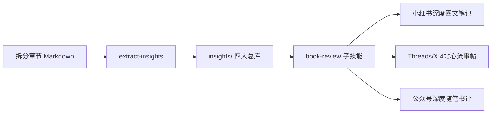

# 高穿透读后感与书评生成子技能 (Sub-skill: book-review)

本子技能作为 `epub-to-markdown` 的专属创作表达层，将拆解出的章节内容及 `extract-insights` 萃取的“4+2 黄金原料”一键转化为适合各大社交平台的**高穿透力爆款读后感与书评**。

---

## 一、核心创作哲学：反课文复述，重生活投射

> **「读者并不是想看你写这本书说了什么，而是想通过这本书，看清他自己最近为什么过得这么累。」**

### 3 大铁律：
1. **禁止“中学语文课代表式复述”**：坚决不写“作者先在第一章论述了A，接着在第二章论述了B”。
2. **表面聊书，实解内耗**：将书中的理论作为“手术刀”，精准剖开当代人在工作、情感、拖延、金钱、人际中的具体困境。
3. **沉静克制，杜绝爹味**：严格遵循用户设定人设：
   - 语气：像深夜和一位信赖的老朋友在窗前交谈。
   - 视角：平视、同理、真诚，不居高临下，不兜售焦虑，不用廉价叹号。

---

## 二、支持的三大平台输出模具

本子技能内置三大平台专属排版模具（详见 `templates/review-templates.md`）：

| 模具名称 | 目标平台 | 核心结构 | 篇幅特点 |
| :--- | :--- | :--- | :--- |
| **模具 A：小红书深度读后图文** | 小红书 (RED) | 痛点直击 + 双行反差标题 + 3个顿悟要点 + 标签 | 600~900 字，段落呼吸感强，适合做滑动长图文 |
| **模具 B：Threads / X 串帖读后感** | Threads / X | 4 帖心流结构（Hook引子 ➔ 认知反转 ➔ 行动解法 ➔ 温柔收尾） | 每帖 ≤ 500 字符，符合一键分帖发布规范 |
| **模具 C：公众号 / 博客深度随笔** | 微信公众号 / 博客 | 生活散文引入 ➔ 书中金句/概念解构 ➔ 现实困境剖析 ➔ 治愈收尾 | 1500~2500 字，注重文笔肌理与沉浸体验 |

---

## 三、原料流动与智能挂载机制



1. **优先抽取**：若目标书籍目录下存在 `insights/` 文件夹，自动从以下总库精准调度素材：
   - `00_全书爆款选题与反直觉库.md` ➔ 提取标题、开篇反直觉切入点 (Hook)
   - `00_读者现实痛点与对号入座索引.md` ➔ 提取第一幕引起读者共鸣的现实病症
   - `00_全书高穿透金句大全.md` ➔ 提取中段作为顿悟支撑的灵魂点睛金句
   - `00_全书核心概念与思维模型图谱.md` ➔ 提取行动解法中的底层逻辑框架
2. **无原料降级**：若尚未执行 `extract-insights`，子技能会直接基于当前章节 `.md` 原文先提炼关键反直觉与痛点，再生成读后感。

---

## 四、触发与使用方式

### 方式 1：自然语言对话驱动（推荐）

在任何时候，直接对 AI 下达指令即可：

```text
# 指定平台与章节
"帮我用小红书模具，写一篇第3章的深度读后感"

# 结合整本书的黄金原料库
"根据 insights 里的痛点索引，以'职场老好人拒绝内耗'为主题写一篇 Threads 串帖读后感"

# 公众号深度随笔
"我想就《纳瓦尔宝典》的核心金句，写一篇发公众号的深夜随笔书评"
```

### 方式 2：使用脚手架脚本生成草稿

在终端中使用内置脚本，指定书籍目录与目标平台：

```bash
# 1. 生成小红书图文模具草稿
python3 scripts/generate_review.py "/path/to/book_output" --platform xhs --topic "精力管理"

# 2. 生成 Threads 4 帖心流串帖
python3 scripts/generate_review.py "/path/to/book_output" --platform threads

# 3. 生成公众号深度长文
python3 scripts/generate_review.py "/path/to/book_output" --platform wechat
```

生成结果将自动保存在书籍目录下的 `reviews/` 文件夹中：
- `reviews/review_xhs_YYYYMMDD_HHMMSS.md`
- `reviews/review_threads_YYYYMMDD_HHMMSS.md`
- `reviews/review_wechat_YYYYMMDD_HHMMSS.md`

---

## 五、质量自检清单 (Checklist)

在输出任何一篇读后感前，必须通过以下自检：
- [ ] **是否戒断了爹味？**（有没有出现“你必须”、“你应该”、“听我一句劝”等居高临下的词句？如果有，改为“我后来才意识到”、“其实我们都在经历”）。
- [ ] **是否在前3秒抓住读者？**（开篇第一句话是否直接道破读者的某项隐秘痛苦，而不是“今天读了一本书”）。
- [ ] **书中金句是否自然融入？**（金句是否有上下文承接，而不是生硬地单列在纸面上）。
- [ ] **行动指南是否极简？**（给读者的解法是否低摩擦、今天下班就能做的一件微行动）。
