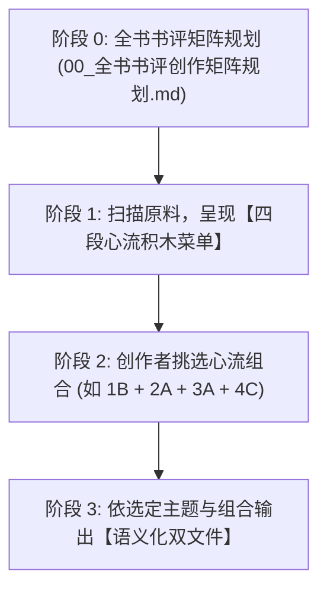

# 高穿透读后感与书评生成子技能 (Sub-skill: book-review v3.0 创作者矩阵版)

本子技能作为 `book-distiller` 的专属创作表达层，将拆解出的章节内容及 `extract-insights` 萃取的“4+2 黄金原料”升级为**“创作者主导的矩阵化人机共创工坊”**：
**全书书评创作矩阵规划 ➔ 四段心流积木自由搭配 ➔ 语义化 Slug 主题命名 ➔ 纯净正文与独立血统溯源双文件交付**。

---

## 一、核心创作哲学：反课文复述，重生活投射

> **「读者并不是想看你写这本书说了什么，而是想通过这本书，看清他自己最近为什么过得这么累。」**

### 3 大铁律：
1. **禁止“中学语文课代表式复述”**：坚决不写“作者先在第一章论述了A，接着在第二章论述了B”。
2. **表面聊书，实解内耗**：将书中的理论作为“手术刀”，精准剖开当代人在工作、情感、拖延、金钱、人际中的具体困境。
3. **沉静克制，杜绝爹味**：严格遵循用户设定人设：
   - 语气：像深夜和一位信赖的老朋友在窗前交谈。
   - 视角：平视、同理、真诚，不居高临下，不兜售焦虑，不用廉价叹号。

---

## 二、标准创作者流水线 (Creator Workflow)



### 阶段 0：全书书评创作矩阵规划 (Review Matrix Planning)
在正式动笔之前，系统自动为全书梳理出 4~6 篇差异化高赞选题（保存在 `reviews/00_全书书评创作矩阵规划.md`），覆盖：
1. **引流爆款向（小红书/Threads）**：直击高频普遍内耗（讨好型人格、拖延、精力枯竭）；
2. **认知觉醒向（Threads/X）**：思维模型反转与认知松绑；
3. **深度沉淀向（微信公众号）**：生活散文起笔，长程深度复盘；
4. **工具实操向（图文收藏向）**：最小阻力微清单与防守红线。

---

### 阶段 1：四段心流积木备选菜单 (Flow Modular Menu)
当选定某个主题后，AI 呈现该主题下的四段心流候选积木：
- **🎯 阶段 1：【Hook / 痛点引子】**（1A 扎心情境型 / 1B 认知打脸型 / 1C 灵魂发问型）
- **💡 阶段 2：【Inversion / 认知反转】**（2A 底层系统归因 / 2B 动机真相剖析 / 2C 视角升维置换）
- **🛠️ 阶段 3：【Action / 极简解法】**（3A 微习惯切片法 / 3B 阻断红线法则 / 3C 三步闭环落地）
- **🌿 阶段 4：【Ending / 灵魂收尾】**（4A 温暖托举祝福 / 4B 极简警醒金句 / 4C 开放留白共勉）

---

### 阶段 2：创作者自由拼配 (Custom Assembly)
创作者以代号（如 `1B + 2A + 3A + 4A`）或追加个性化观点进行确认。

---

### 阶段 3：语义化 Slug 双文件分离交付 (Dual-file Delivery with Slug)
自动注入文章主题 Slug，方便本地检索与长久管理：
1. **纯净正文 (`review_{platform}_{slug}_{timestamp}.md`)**：
   - 100% 纯净可直接发布文案，文末附跳转链接：`> 🧬 本文设计演进与完整血统溯源档案：见同目录下的 [review_{platform}_{slug}_{timestamp}_provenance.md](./review_{platform}_{slug}_{timestamp}_provenance.md)`
2. **独立溯源图谱 (`review_{platform}_{slug}_{timestamp}_provenance.md`)**：
   - 📊 **选定心流联系图谱 (Mermaid)**：可视化流向网络。
   - 📋 **核心要素血统溯源表**：原著章节、出处原文、原料卡映射、创作者心理学设计意图。
   - 🧠 **关联知识双链 (Obsidian Wikilinks)**。

---

## 三、常用终端命令

```bash
# 1. 为书籍规划全书创作矩阵表
python3 scripts/generate_review.py "/path/to/book_output" --matrix

# 2. 依据选定主题和心流组合生成语义化双文件
python3 scripts/generate_review.py "/path/to/book_output" --platform xhs --topic "精力管理与停止内耗" --combo "1B+2A+3A+4A"
```
