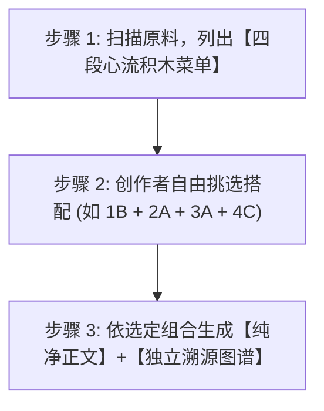

# 高穿透读后感与书评生成子技能 (Sub-skill: book-review v2.9)

本子技能作为 `book-distiller` 的专属创作表达层，将拆解出的章节内容及 `extract-insights` 萃取的“4+2 黄金原料”升级为**“创作者主导的人机共创工坊”**：
**先列出四段心流候选积木 ➔ 创作者自由挑选题材与心流搭配 ➔ 一键生成高穿透正文与独立血统溯源图谱**。

---

## 一、核心创作哲学：反课文复述，重生活投射

> **「读者并不是想看你写这本书说了什么，而是想通过这本书，看清他自己最近为什么过得这么累。」**

### 3 大铁律：
1. **禁止“中学语文课代表式复述”**：坚决不写“作者先在第一章论述了A，接着在第二章论述了B”。
2. **表面聊书，实解内耗**：将书中的理论作为“手术刀”，精准剖开当代人在工作、情感、拖延、金钱、人际中的具体困境。
3. **沉静克制，杜绝爹味**：严格遵循用户设定人设：
   - 语气：像深夜和一位信赖的老朋友在窗前交谈。
   - 视角：平视、同理、真诚，不居高临下，不兜售焦虑，不用廉价叹号。

---

## 二、标准人机共创三步流水线 (3-Step Co-creation Pipeline)



### 步骤 1：列出四段心流自由搭配菜单 (Flow Menu)
当用户触发写读后感需求时，AI **首先扫描 `insights/` 原料库与原章节**，为创作者列出四段心流的备选项：

1. **🎯 阶段 1：【Hook / 痛点引子】（挑一个最想聊的切入点）**
   - **[1A 扎心情境型]**：具象描摹读者在工作/生活中的疲惫与内耗瞬间
   - **[1B 认知打脸型]**：用原书的反直觉事实打破大众常规盲区
   - **[1C 灵魂发问型]**：用一句直击本质的尖锐提问开门见山
2. **💡 阶段 2：【Inversion / 认知反转】（挑一个作为核心解释）**
   - **[2A 底层系统归因]**：指出痛苦不是个人不努力，而是底层认知模型设错了
   - **[2B 动机真相剖析]**：剥开借口，直面内心深处对失控或被拒绝的恐惧
   - **[2C 视角升维置换]**：引入原书思维模型，将问题从死胡同转移到更高维度
3. **🛠️ 阶段 3：【Action / 极简解法】（挑一个可落地的行动抓手）**
   - **[3A 微习惯切片法]**：下班后、睡前 5 分钟就能做的最小阻力动作
   - **[3B 阻断红线法则]**：不再逼自己做什么，而是列出一条“绝不再消耗自己”的底线
   - **[3C 三步闭环落地]**：情绪察觉 ➔ 记录阻抗 ➔ 最小复盘的具体执行流程
4. **🌿 阶段 4：【Ending / 灵魂收尾】（挑一个传递给读者的余音）**
   - **[4A 温暖托举祝福]**：沉静平视的深夜促膝长谈，抚平内疚与自我苛责
   - **[4B 极简警醒金句]**：留下一句极具穿透力、适合做壁纸或转发的灵魂判词
   - **[4C 开放留白共勉]**：留下一个给未来的叩问，引发读者思考

---

### 步骤 2：创作者自由挑选与自定义 (Custom Assembly)
创作者可以使用简短语法快速确认，也可以微调注入自己的思考：
- **极简确认**：`1B + 2A + 3A + 4C`
- **微调混搭**：`1A + 2B + 3A + 收尾我想用自己的这段话：“……”`

---

### 步骤 3：双文件分离输出 (Dual-File Delivery)
确认组合后，AI 按挑选的积木组合生成文章，并强制拆分为两个独立文件：

1. **纯净正文文件 (`review_{platform}_xxx.md`)**：
   - 包含完整标题、正文排版与标签，排版呼吸感强，无技术杂质，**创作者可一键全选复制直接发平台**。
   - 文末仅附一行跳转链接：`> 🧬 本文设计演进与完整血统溯源档案：见同目录下的 [review_{platform}_xxx_provenance.md](./review_{platform}_xxx_provenance.md)`
2. **独立溯源图谱 (`review_{platform}_xxx_provenance.md`)**：
   - 📊 **创作设计联系图谱 (Mermaid)**：清晰绘制本次选定的心流路径（如 `1B ➔ 2A ➔ 3A ➔ 4C` 对应原著与原料库的流向）。
   - 📋 **核心要素血统溯源表**：逐项对齐原著出处、原料卡与创作心理学意图。
   - 🧠 **关联知识双链 (Obsidian Wikilinks)**。

---

## 三、触发指令示例

```text
# 触发心流菜单（推荐标准流）：
"我想写一篇《纳瓦尔宝典》第 2 章的小红书读后感，先给我列出四段心流备选积木，我来挑"

# 创作者回复搭配后：
"我选 1A + 2C + 3B + 4A，帮我写出纯净正文和溯源档案"
```

也可以通过终端脚本生成四段心流备选菜单：
```bash
# 生成包含四段心流积木与草稿的脚手架
python3 scripts/generate_review.py "/path/to/book_output" --platform xhs --topic "精力管理"
```
