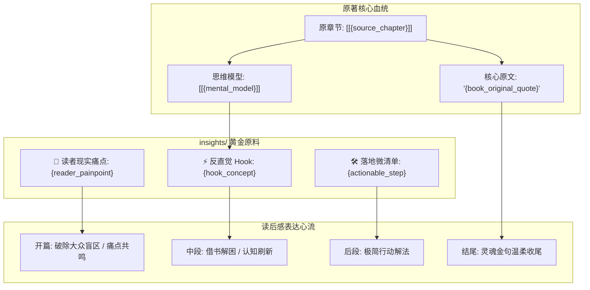

# 📝 高穿透读后感心流模具 (Book Review Templates)

---

## 模具 A：小红书深度读后图文笔记 (收藏转化向)

**【建议封面/第1图】**：书本实拍 / 极简纯色金句图卡 (可用 card-xiaohongshu 生成)
**【双行吸睛标题】**：
- 第一行（痛点反差）：读完《{book_title}》，我终于治好了{target_painpoint}
- 第二行（情绪价值）：原来我们所有内耗，都在逃避这一个真相。

**【笔记正文排版】**：
很长一段时间，我都以为{conventional_wisdom}。
直到深夜翻开《{book_title}》，看到作者写下的这一句：
> “{golden_quote}”
当时瞬间有一种被击中的感觉。原来我一直以来的挣扎，不是因为我不够努力，而是因为{core_insight}。

总结书里彻底改变我认知的 3 个底层思考，分享给同样在经历{target_painpoint}的你：

💡 **1. {insight_1_title}**
{insight_1_body}

💡 **2. {insight_2_title}**
{insight_2_body}

💡 **3. {insight_3_title}**
{insight_3_body}

🌱 **写在最后：**
{closing_echo}
如作者所说：“{closing_quote}”。
愿你在这个喧嚣的世界里，找到属于自己的秩序。

🏷️ **推荐标签**：#{book_tag} #深度好书推荐 #治愈内耗 #女性成长 #认知觉醒

---

## 模具 B：Threads / X 串帖读后感 (病毒传播向)

**Post 1 (Hook 引子)**：
刚读完《{book_title}》，里面有句话彻底扎醒了我：
“{golden_quote}”

表面上是在讲{book_subject}，本质上却是在替我们表达那些说不清的痛苦。
如果你最近也经常感到{target_painpoint}，这篇笔记或许能给你一点答案。🧵👇

**Post 2 (认知反转)**：
我们从小被教育要{conventional_wisdom}。
但作者指出了一个极度扎心的真相：
{contrarian_insight}。
当你习惯了{bad_habit}，你其实是在放弃对自己生活的掌控权。

**Post 3 (行动解法)**：
书里给出了一个极度实操的行动闭环：
1️⃣ {step_1}
2️⃣ {step_2}
3️⃣ {step_3}
越是迷茫痛苦的节点，越不要在脑海里死磕，回到现实里做最小阻力动作。

**Post 4 (温柔收尾)**：
“{closing_quote}”
你所承受的痛苦加上反思，最终都会成为你的铠甲。
找个安静的深夜，认真翻翻这本书吧，它值得被读两遍。

---

## 模具 C：公众号 / 博客深度随笔书评 (沉浸共鸣向)

**【主标题】**：《{book_title}》：你不是能力不够，你只是从未真正看清现实
**【副标题】**：一篇写给经常陷入“自我怀疑”与“精神内耗”朋友的深夜读书信

**【第一部分：痛点引子 · 照镜子】**
(讲述一个具体的生活场景，唤起读者强烈的代入感，引出翻开这本书的契机...)

**【第二部分：认知颠覆 · 解开死结】**
(打破传统认知的遮羞布，借用书中的核心思维模型，剖析为什么大部分人会陷入这种困境...)

**【第三部分：真实案例 · 他山之石】**
(引用书里的微故事/人物经历，讲述破局的关键动作，让说服力达到顶峰...)

**【第四部分：落地工具 · 如何开始】**
(给出一套读者能在明天早晨起床就执行的行动微清单...)

**【第五部分：温柔托举 · 给予力量】**
(以深夜好友聊天的姿态收尾，给读者释怀与前行的底气，配上最有穿透力的金句...)

---

## 模具 D：完整血统溯源与联系图谱 (Provenance & Lineage Blueprint)

> **设计宗旨**：让每一次创作都不是空中楼阁，清晰展示文章每一句话背后的原著出处、心理学意图与知识图谱流动。

```markdown
---
### 🧬 完整血统溯源与设计联系图谱 (Lineage & Provenance)

#### 1. 📊 创作逻辑联系图谱


#### 2. 📋 核心要素血统溯源表
| 文章模块 / 关键文案 | 原著章节与出处 | insights 原料卡映射 | 创作者意图与心理学设计 |
| :--- | :--- | :--- | :--- |
| **标题 / Hook** | 《{book_title}》{source_chapter_name} | `00_全书爆款选题与反直觉库.md` | **打破认知防御**：用生活常见误区制造反差好奇 |
| **痛点唤醒** | 原书关于{chapter_topic}的论述 | `00_读者现实痛点与对号入座索引.md` | **建立同盟共情**：描摹具体疲惫场景，消除说教感 |
| **认知反转** | 原书核心论证第 X 节 | `00_全书核心概念与思维模型图谱.md` | **提供新解释框架**：将个人内疚归因于认知模型缺陷 |
| **行动指南** | 原书案例中的行动总结 | 对应章节原料卡第 3 节 (微清单) | **促成收藏与执行**：给低阻力、今天下班就能做的一件事 |
| **点睛金句** | 原书第 X 页原文 | `00_全书高穿透金句大全.md` | **驱动转发与共鸣**：深夜治愈底色，让读者产生分享欲 |

#### 3. 🧠 关联知识双链 (Obsidian Wikilinks)
- [[{mental_model_1}]]
- [[{mental_model_2}]]
- [[{source_chapter_link}]]
```

---

## 模具 E：四段心流积木自由搭配菜单规范 (Mental Flow Modular Menu)

在写任何文章之前，先向用户呈现当前书籍/章节主题下的“四段心流候选积木清单”：

### 🎯 阶段 1：【Hook / 痛点引子】（挑一个你最想聊的切入点）
- **[1A 扎心情境型]**：具象描摹读者的生活内耗或深夜焦虑瞬间（引起“这就是我”的强烈共鸣）
- **[1B 认知打脸型]**：用反直觉的事实打破大众常规盲区（引起“原来我一直搞错了”的好奇）
- **[1C 灵魂发问型]**：用一句直击本质的尖锐提问开门见山（快速破除心防）

### 💡 阶段 2：【Inversion / 认知反转】（挑一个作为本书的核心解释）
- **[2A 底层系统归因]**：指出痛苦不是个人不努力，而是底层规则或认知模型设错了
- **[2B 动机真相剖析]**：剥开表面借口，直面内心深处对不确定性或被拒绝的恐惧
- **[2C 视角升维置换]**：引入原书的核心概念或隐喻，将问题从死胡同转移到更高维度

### 🛠️ 阶段 3：【Action / 极简解法】（挑一个让读者能立刻行动的抓手）
- **[3A 微习惯切片法]**：今天下班后、睡前 5 分钟就能做的阻力最小微动作
- **[3B 阻断红线法则]**：不再逼自己做什么，而是列出一条“绝不再消耗自己”的红线
- **[3C 三步闭环落地]**：观察情绪 ➔ 记录阻抗 ➔ 最小复盘的具体执行流程

### 🌿 阶段 4：【Ending / 灵魂收尾】（挑一个最想传递给读者的余音）
- **[4A 温暖托举祝福]**：沉静平视的深夜促膝长谈，抚平读者的内疚与自我苛责
- **[4B 极简警醒金句]**：留下一句极具穿透力、适合做壁纸或转发的灵魂判词
- **[4C 开放留白共勉]**：邀请读者在评论区或心底给自己一个交代，留下思考回音

👉 **创作者自由组合语法**：
用户只需回复代号即可，如：`1B + 2A + 3A + 4A`（也可以自由补充个性化要求）。
确认组合后，AI 再按选中的心流积木组合生成正文，并在文末血统溯源图谱中清晰展现该心流路径！

---

## 模具 F：全书书评创作矩阵规划表 (Review Matrix Planning)

> **设计宗旨**：将一整本书的精华拆解为 4~6 篇差异化社交媒体选题，兼顾深度干货、情绪共鸣与痛点破局，系统化排期发布。

```markdown
# 🗺️ 《{book_title}》全书书评创作矩阵规划表

> 本规划表将全书核心概念与反直觉认知，转化为 4~6 篇针对不同平台、受众心理与生活场景的高穿透选题。

| 序号 | 选题大标题 | 目标平台 | 读者切入痛点 (Hook) | 依托章节与核心概念 | 推荐四段心流组合 | 创作状态 |
| :--- | :--- | :--- | :--- | :--- | :--- | :--- |
| **01** | 《{topic_1_title}》 | 小红书 (图文) | {painpoint_1} | [[{chapter_1}]] · [[{model_1}]] | `1B + 2A + 3A + 4A` | 待创作 |
| **02** | 《{topic_2_title}》 | Threads / X | {painpoint_2} | [[{chapter_2}]] · [[{model_2}]] | `1A + 2B + 3B + 4B` | 待创作 |
| **03** | 《{topic_3_title}》 | 公众号 (长随笔) | {painpoint_3} | [[{chapter_3}]] · [[{model_3}]] | `1C + 2C + 3C + 4A` | 待创作 |
| **04** | 《{topic_4_title}》 | 小红书 / 博客 | {painpoint_4} | [[{chapter_4}]] · [[{model_4}]] | `1B + 2C + 3A + 4B` | 待创作 |

### 💡 选题矩阵布局策略：
1. **引流爆款篇（小红书/Threads）**：抓普遍人性的高频内耗（如讨好型人格、拖延、精力枯竭），重在情绪反差与反直觉。
2. **深度沉淀篇（公众号/博客）**：结合具体生活随笔解构底层认知模型，建立创作者专业信任与长期粉丝黏性。
3. **极简工具篇（收藏向图文）**：提供极低阻力的可落地行动微清单，驱动高收藏率与转发率。
```
