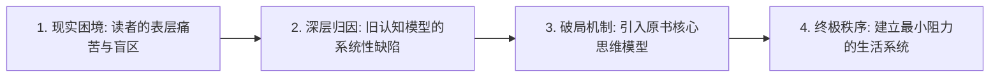

# 📑 《{book_title}》全书一页纸决策简报 (1-Page Executive Summary)

> **导语**：本书深度研读与自媒体创作的“全局定盘星”。用 3 分钟通读，看透全书底层逻辑、反常识洞见与核心破局点。

---

### 一、 📌 一句话本质判词 (The Core Thesis)
> **表面上**，本书在探讨【{surface_topic}】；  
> **本质上**，作者是在用一套全新的认知系统，替当代人彻底重构【{underlying_truth}】。

---

### 二、 ⚡️ 三大最具穿透力的反常识断言 (Top 3 Contrarian Truths)

1. **【{contrarian_1_title}】**
   - **大众常识误区**：{myth_1}
   - **原书颠覆真相**：{truth_1}
   - **现实杀伤力**：⭐⭐⭐⭐⭐（直击痛点：{painpoint_1}）

2. **【{contrarian_2_title}】**
   - **大众常识误区**：{myth_2}
   - **原书颠覆真相**：{truth_2}
   - **现实杀伤力**：⭐⭐⭐⭐（直击痛点：{painpoint_2}）

3. **【{contrarian_3_title}】**
   - **大众常识误区**：{myth_3}
   - **原书颠覆真相**：{truth_3}
   - **现实杀伤力**：⭐⭐⭐⭐⭐（直击痛点：{painpoint_3}）

---

### 三、 🧠 作者底层逻辑推导闭环 (The Architecture)

- **第一阶段（认清真相）**：剥离情绪内耗，客观面对残酷的现实事实（不回避、不自欺）；
- **第二阶段（模型置换）**：将个人内疚归因于“工具与规则的落后”，引入原书核心概念；
- **第三阶段（行动闭环）**：通过可落地的最小反馈回路，在现实中反复微调与校准。

---

### 四、 🎯 读者适合度诊断 (Fit Diagnosis)

| 适合谁立刻读（强烈推荐） | 谁读了是浪费时间（劝退建议） |
| :--- | :--- |
| ✅ **长期陷入精神内耗与自我怀疑的人**：急需一套清晰的外部参照系建立秩序。 | ❌ **只想找快餐式心灵鸡汤的人**：本书没有廉价安慰，只有冷峻的理性推演。 |
| ✅ **努力很久却总在原地打转的终身学习者**：需要找到努力的真正发力点。 | ❌ **抗拒自我反思与改变的人**：读完可能会感到被冒犯或认知失调。 |
| ✅ **内容创作者 / 知识博主**：书中充满了反直觉认知、高穿透金句与爆款选题。 | ❌ **只想要现成模板抄作业的人**：本书给的是底层心智，而非固定答案。 |

---

### 五、 💎 全书灵魂锚点金句 (The Anchor Quote)

> **「{anchor_quote}」**  
> *—— 来源原书：[[{anchor_quote_source}]]*

---

### 六、 🚀 创作者行动抓手 (Creator Takeaways)

- **小红书发帖切入点**：围绕【{contrarian_1_title}】，用“读完这本书，我终于停止了自我惩罚”作双行标题。
- **Threads/X 串帖切入点**：围绕【{contrarian_2_title}】，以 4 帖心流拆解努力反向的认知误区。
- **公众号长文切入点**：结合具体生活案例，完整推导全书的思维模型演进图谱。
